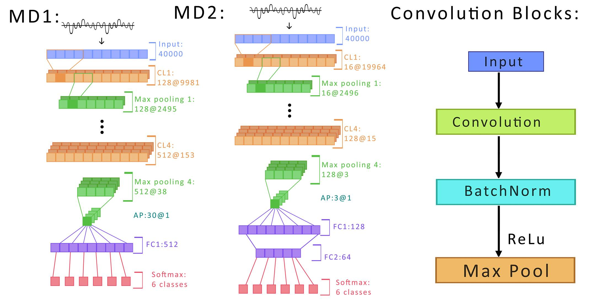
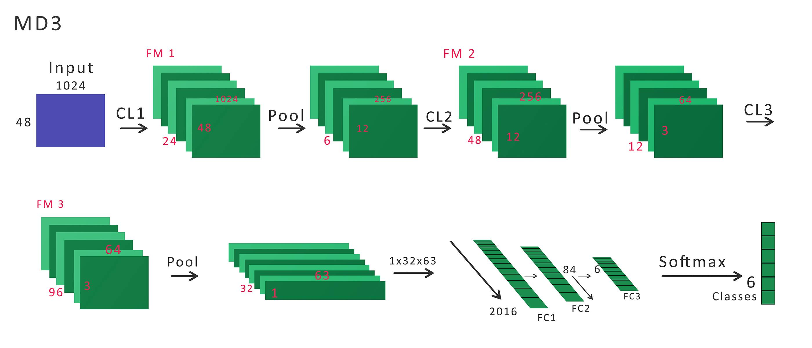
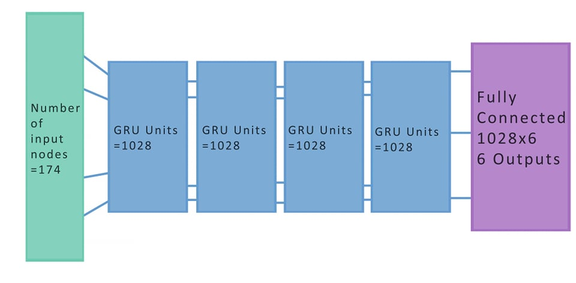

This is the 3VGC project for classifying video using a tri-modal pipeline (video/audio/text). See `3VGC_report.pdf` for a paper detailing the project.

Run `pip install -r requirements.txt` to install dependencies.

We use Python 3 for all scripts along with `FFmpeg` for audio feature extraction and sampling audio from the YouTube videos.

The results are in root directory of the repo (`Results_X(configuration).xlsx` and `eval_results.csv`).

If you have trouble with `torchaudio`, try these commands:

    apt-get install sox libsox-dev libsox-fmt-all
    pip install git+git://github.com/pytorch/audio`
    
### Architectures:

MD1 and MD2:

MD3:

GRU network:

